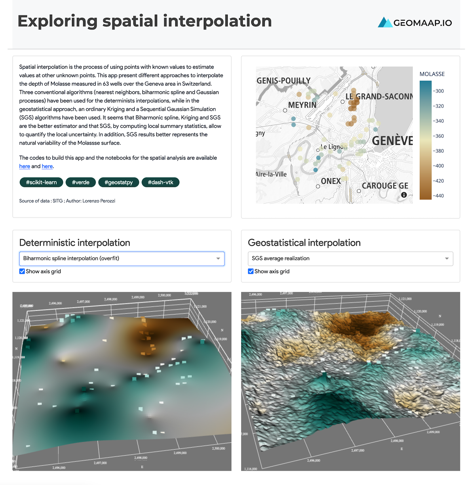

## Goal

The goal of that example is to compare different interpolation algorithms and visualize the results in dash vtk-framework.

## Instruction

First clone this repo:

``` bash
git clone https://github.com/lperozzi/Spatial_interpolation_app
cd Spatial_interpolation_app
```

Create a venv and install the requirements:
```bash
python -m venv venv
source venv/bin/activate  # for Windows, use venv\Scripts\activate.bat
pip install -r requirements.txt
```

Run the demo:
```bash
python app.py
